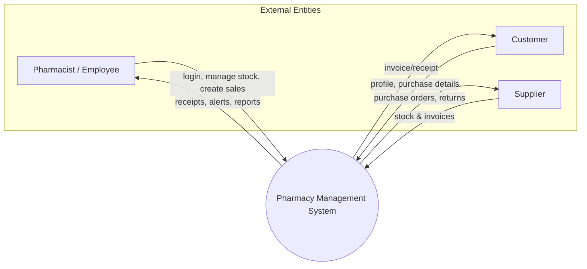

# Pharmacy Management System — Data Flow Diagrams (DFD)

These diagrams describe external entities, core processes, and data stores based on the implemented schema in [python_backend/schema.sql](../python_backend/schema.sql).

Note: Mermaid is used to sketch DFDs; shapes approximate standard notation.

---

## Level 0 — Context Diagram



---

## Level 1 — Major Processes and Data Stores

```mermaid
flowchart TB
  DB[((PostgreSQL Database))]

  subgraph Entities
    U[Pharmacist / Admin]
    C[Customer]
    S[Supplier]
  end

  P1([Authenticate User])
  P2([Manage Medicines & Inventory])
  P3([Manage Customers & Prescriptions])
  P4([Process Sales & Generate Invoice])
  P5([Supplier & Purchasing])

  %% External interactions
  U -->|credentials| P1
  P1 -->|session token| U

  U --> P2
  U --> P3
  U --> P4
  U --> P5

  C -->|details| P3
  P4 -->|invoice/receipt| C

  S -->|delivery notes| P5
  P5 -->|PO/returns| S

  %% Data stores (schema tables)
  P1 <-->|read/write| DB
  P2 <-->|medicines, inventory, suppliers| DB
  P3 <-->|customers, prescriptions| DB
  P4 <-->|sales, sales_items, inventory| DB
  P5 <-->|suppliers, inventory| DB
```

Data store mapping (from schema):
- Users/Auth: `users`, `auth_tokens`, `pharmacy`.
- Catalog/Stock: `medicines`, `inventory`, `suppliers`.
- Customer Care: `customers`, `prescriptions`, `orders` (optional front office flow).
- Sales: `sales`, `sales_items` (inventory decrements from batches).

---

## Level 2 — Process: Process Sales & Generate Invoice (P4)

```mermaid
flowchart LR
  subgraph Entities
    U[Cashier]
    C[Customer]
  end

  DB[((DB: medicines, inventory, customers, sales, sales_items))]

  A1([Select Items])
  A2([Validate Stock by Batch])
  A3([Price, Discount & Tax Calc])
  A4([Persist Sale Header])
  A5([Persist Line Items]))
  A6([Adjust Inventory Quantities])
  A7([Generate Invoice]))

  U -->|items, qty| A1
  A1 --> A2
  A2 -->|ok / error| U
  A2 --> A3
  A3 --> A4
  A4 --> A5 --> A6 --> A7

  %% Data interactions
  A1 -->|lookup names| DB
  A2 <-->|read inventory (by barcode/batch)| DB
  A3 -->|no write| DB
  A4 -->|insert into sales| DB
  A5 -->|insert into sales_items| DB
  A6 -->|update inventory.quantity| DB
  A7 -->|invoice number & totals| U
  A7 -->|receipt| C
```

Key rules enforced:
- Stock validation reads `inventory` for the selected batch (`inventory_id`/`barcode`).
- Sale persistence creates `sales` first, then `sales_items` rows.
- Inventory decrements per batch; pricing captured as `unit_price` at time of sale.

---

## Level 2 — Process: Manage Medicines & Inventory (P2)

```mermaid
flowchart TB
  U[Admin / Storekeeper]
  DB[((DB: medicines, inventory, suppliers))]

  B1([Add/Update Medicine Master])
  B2([Receive Purchase / Create Batch])
  B3([Set Selling & Purchase Prices])
  B4([Barcode / Batch Assignment])
  B5([Expiry & Stock Audits])

  U --> B1 --> DB
  U --> B2 --> DB
  U --> B3 --> DB
  U --> B4 --> DB
  U --> B5 --> DB

  DB -->|low stock / expiry alerts| U
```

Notes:
- Batch is modeled in `inventory(batch_id, expiry_date, supplier_id, purchase_price, selling_price, barcode)` tied to `medicines(id)`.
- Optional uniqueness recommended: `inventory(medicine_id, batch_id)` and `sales_items(sale_id, inventory_id)`.

---

### How to use
- Embed these diagrams in docs or export to images using a Mermaid-compatible renderer (e.g., VS Code Mermaid extension or static site generator).
- Keep diagrams updated when tables or core flows change.
